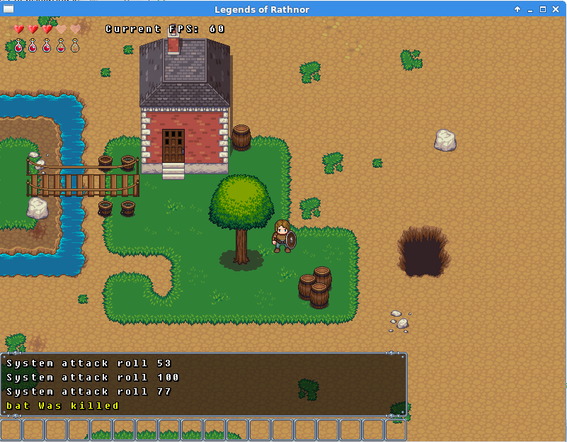

JASON TEST BUILD
For the game to run you need to have all ready installed love2d version .8 on your system.
You can find source and binaries for love2d at https://love2d.org/

https://love2d.org/wiki/Getting_Started provides instructions on how to run or make an executable of the game.

Arrow keys and WASD will move the player
pressing 'SPACE' will attack
pressing 'g' will warp you back to starting location. Note: that this works incorrectly on the inside map.
pressing 'c' will open your character sheet and inventory you can close this by pressing 'c' again or by clicking the "x"
on the top of each window.

pressing 'p' will do the spell casting animation. Note: this will currently crash the game.
there currently are no mouse events, but there will be once items, spell and skills are in place.